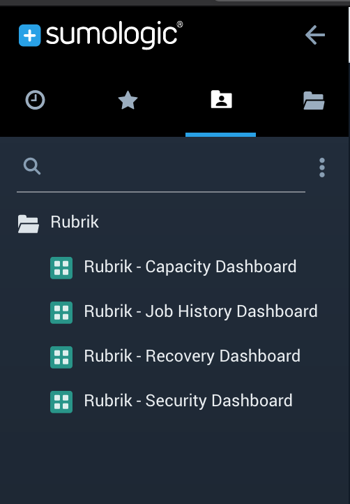
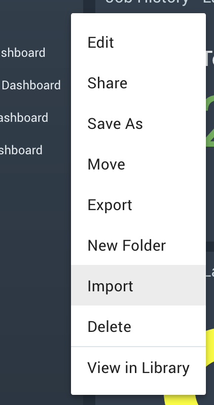
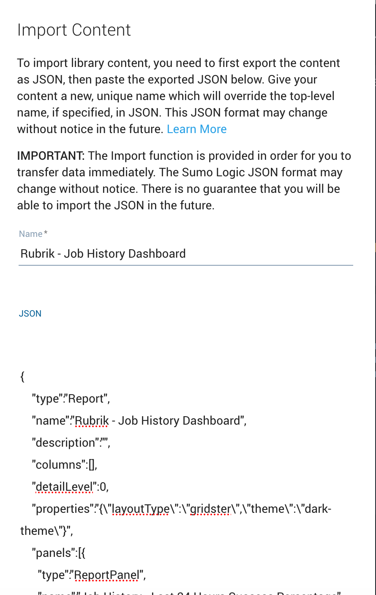
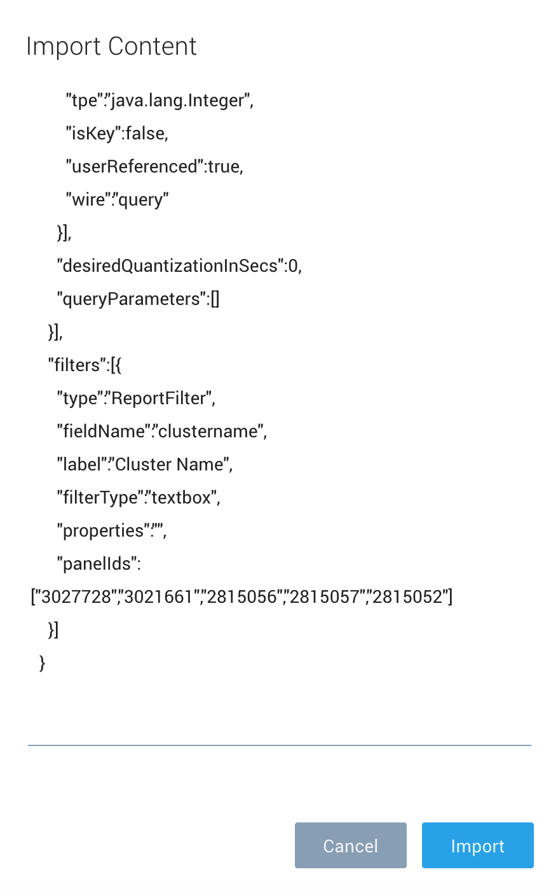

# Configuring the Rubrik SumoLogic integration

## Overview

This document details the configuration of the Rubrik SumoLogic integration pack.

## Pre-requisites

### Collector Host

The collector source scripts are written in Python, and as such will require a collector installed on a server with Python installed. In addition, the following modules are required, these can be installed using pip (the Python package manager):

* `datetime`
* `requests`
* `json`
* `base64`
* `os`

NOTE: all of these should be core except `requests`

The collector should have access on HTTPS/TCP443 to the Rubrik clusters it will be collecting data from.

### Clusters

The clusters to collect data from are defined in each Python script. At the time of writing, SumoLogic does not have a central credential store, so these must be defined here. These are defined in a JSON array as follows:

```json
{
    "cluster-1":{
        "ip":"10.100.1.10",
        "user":"admin",
        "pass":"pass123!"
    },
    "cluster-2":{
        "ip":"10.100.2.10",
        "user":"admin",
        "pass":"pass123!"
    }
}
```

Clusters can be added and removed to this array, along with the IP address, username, and password for accessing the cluster (use floating IPs where possible to avoid the inability to collect data in the event of a node becoming inaccessible).

The completed JSON for the target environment can then replace the following variable definition in each of the Python scripts:

```python
rubrik_clusters = {
    'cluster-1':{
        'ip':'10.100.1.10',
        'user':'admin',
        'pass':'pass123!'
    }
}
```

Now when the script runs it will gather data from all of the clusters defined here.

## Creating the collector sources

The sources are defined below:

Source Name | Script | Frequency
--- | --- | ---
rubrik_cluster_io_stats | `rubrik_cluster_io_stats.py` | Every 5 mins
rubrik_event_feed | `rubrik_event_feed.py` | Every 5 mins
rubrik_live_mounts | `rubrik_live_mounts.py` | Every 15 mins
rubrik_runway_remaining | `rubrik_runway_remaining.py` | Every Hour
rubrik_storage_summary | `rubrik_storage_summary.py` | Every 15 mins

Beyond these specific settings, the following settings should be used for each source:

* **Command** - /usr/bin/python
* **Working Directory** - /tmp
* **Enable timestamp parsing** - Checked
* **Time Zone** - Use time zone from log file. If none is present use collector default
* **Timestamp Format** - Automatically detect the format
* **Detect messages spanning multiple lines** - Checked
* **Enable Multiline Processing** - Infer Boundaries - Detect message boundaries automatically

## Importing the dashboards

The dashboards are defined using JSON templates, steps for creating these are below. The following table lists the dashbaord names and associated JSON template:

Dashboard Name | Template Name
--- | ---
Rubrik - Capacity Dashboard | `rubrik_capacity_dashboard.json`
Rubrik - Job History Dashboard | `rubrik_job_history_dashboard.json`
Rubrik - Recovery Dashboard | `rubrik_recovery_dashboard.json`
Rubrik - Security Dashboard | `rubrik_security_dashboard.json`

To import the dashboards, go to folder view in SumoLogic, and create a folder named Rubrik:



Right click on the folder and click 'Import':



Enter the name of the dashboard, as detailed in the table above:



Paste in the copy of the dashboard JSON and click Import:


